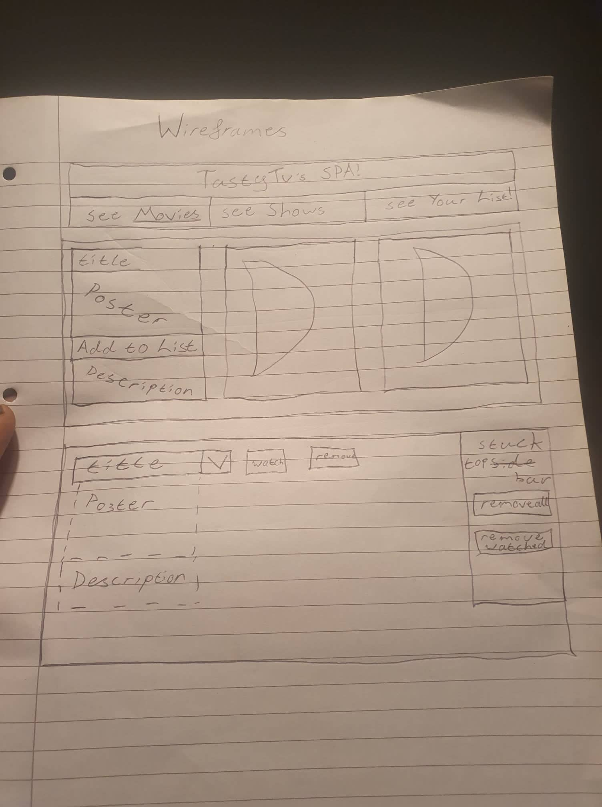

# Tasty TV Promotional Website.

An SPA for a fictional streaming company.
Created using Javascript, HTML & CSS bundle within jsx and react.

materials and materials icons from MUI were used for styling.

## Table of contents

- [Introduction](#introduction)
- [Technologies & Designing](#technologies-used-&-designing)
- [Launch](#launch)
- [To Do](#to-do)
- [List Of Known Issues](#list-of-known-issues)
- [Lessons Learnt](#lessons-learnt)

### Introduction

Tasty TV's SPA was made for my second course project, specifically on React. It is here to evaluate my skill with the languages used. Whilst accessing my ability to deliver on the deliverables from a 'clients brief'. Finally it was also to access my capabilities with independent research.

### Technologies Used & Designing

- Javascript
- HTML
- CSS
- JSX
- React

Codesandbox was the platform used during the creation.
Github held the repository which wasn't adequately committed to.

MUI material and material-icons were used for styling purposes.

https://mui.com/components/material-icons/

Several can be seen withing the SPA and they were found from the link above.

https://docs.google.com/document/d/1RhiBxOM96SwfT9wdGYI6DaqgXthhX0Pj6yq3HEctUxk/edit?usp=sharing

Above you will see a link to the Google Doc I had created & below is the wireframe I sketched up. It goes without saying it is lackluster.

[]

### Launch

URL: (https://csb-2fx79-7f5l3y55u-clive07.vercel.app/)

If I am not mistaken all you have to do is ensure javascript is enabled and it should work just fine.

### To Do

- add media item to users list
- edit a media item
- mark a media item as wathed
- remove an item from users list
- remove all items from users list
- remove all watched items from users list
- allow the App to fetch data from the client API

### List Of Known Issues

Unfortunately there are a few!

#### list of media display index bug

I was having issues with toggling the media display cards on the carousel. You will see upon using the app.

Essentially each individual media display component has an id element which is its index number. This meant if I displayed identical lists. removed one from the middle. suddenly they no longer corresponded with eachother.

I believe the fix to this was change its id to the media's actual id. And then use .find within the function being called to execute another function on the specific media item.

if I am not mistaken this way the order it is in is irrelevant. It will always correspond with the same media item within a different display list.

#### carousel to oblivion bug.

As you can see using the carousel. it doesn't acknowledge where the items within it are. Only to move them left or right. This means the list can disappear into oblivion which is no good!

with my current skillset my solution to this problem would be research! I could set a state keeping track of the count and if it has moved yet to ensure it won't at least go past the first one but I am unsure as to how I'd stop it going too far in the other direction.

with time i'd look into how to have it loop like a genuine carousel.

#### Bad Review!

You will notice there is a review component which has been commented out.

the hope was to have a textarea the user could fill with their review and save it to the media item. With the ability to edit it after the fact.

unfortunately my execution of this was lacking and with time against me I decided to lean towards the like/dislike rating system which is ok.

I now know I would have a separate state containing all reviews and each media display item would have a text area the user could fill in with their review and then save.

Only on their user page could they see, edit or delete these reviews.

#### TMI Reveal!

I was hoping to make it so that the user would see only the image of each media and upon clicking one of them it would enlarge and show the details about it with the options to toggle things.

Although I did to a degree get this to work. It was clunky. Looked untidy and wasn't thought as well enough.

If I was to do it now. I think it can be done well with useRef. This way I can enlarge the box for the media content and reveal the extra parts in a cleaner fashion.

I would need some sort of state which makes it so if something is clicked. It and ONLY it would be enlarged. otherwise all items would stay big!

unfortunately with time restraints and a clunky skillset it couldn't be done.

### Lessons Learnt

Designing is more than just picking a nice colour scheme!

I took for granted how powerful and useful the designing and planning stage could be. My problem was I saw it only as design and not plan. Several days in I started to realise my mistake and once I could picture the method and path through the madness I then started to see some much better results.

If I at the start had more patience to think out each component more methodically I believe I would have been able to more than capable of completing all the stretch goals.

I will say my approach of putting down the stretch goals was a good call. Although I knew how to go about calling a 3rd party API and had an idea for executing the deliverable via a 'search for show' search bar and result page. I know it would've taken a while and there simply wasn't enough time to get it all done.
